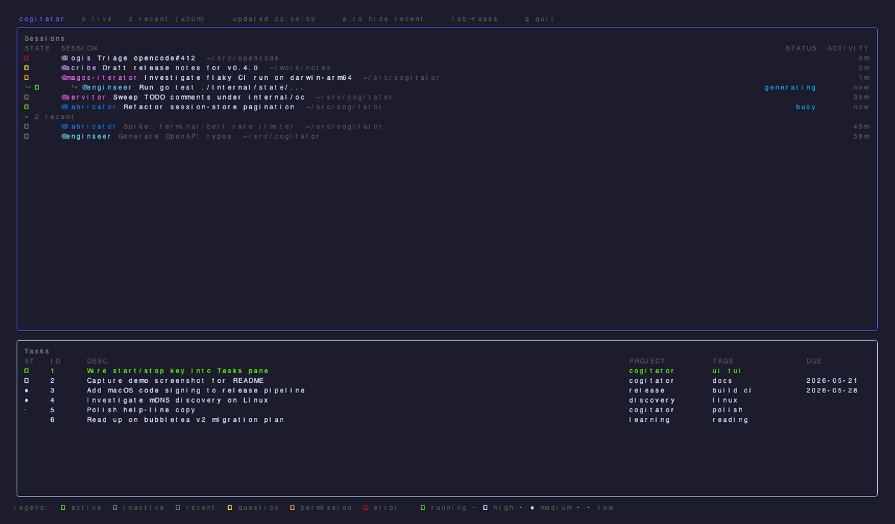

# cogitator

`cogitator` is a terminal monitor for locally running [opencode](https://opencode.ai) instances.
It discovers instances over mDNS, subscribes to their event streams, and renders one live sessions view with attention signals (permission requests, pending questions, and errors). When [Taskwarrior](https://taskwarrior.org) is installed, it also embeds a Tasks pane for adding, editing, starting/stopping, completing, and deleting tasks without leaving the TUI.

<p align="center">
  
</p>

## Install

### Go install

```sh
go install github.com/guilhermehto/cogitator/cmd/cogitator@latest
```

### Homebrew

Homebrew support is published through `guilhermehto/homebrew-tap` once release automation is configured.

## Supported OS

| OS | Support |
| --- | --- |
| macOS | Supported |
| Linux | Supported |
| Windows | Not supported |

## Prerequisite

Each opencode instance you want to monitor must be launched with `--mdns` so
it advertises itself on `_http._tcp.local.`:

```sh
opencode --mdns                       # default port (random)
opencode serve --mdns --port 7777     # headless, fixed port
```

You can launch as many as you like; cogitator discovers them automatically.

## Run

```sh
cogitator
```

or from source:

```sh
go run ./cmd/cogitator
```

`q`, `Esc`, or `Ctrl+C` quits.

### Key bindings

| Key | Context | Action |
| --- | --- | --- |
| `T` | anywhere (outside a prompt) | show or hide the Tasks pane |
| `Tab` | anywhere (outside a prompt) | swap focus between Sessions and Tasks panes when Tasks is shown |
| `j` / `k` | Tasks pane focused | move cursor down / up |
| `a` | Tasks pane focused | open inline prompt to add a new task |
| `e` | Tasks pane focused | open inline prompt to edit the selected task |
| `s` | Tasks pane focused | start the selected task, or stop it if already running |
| `d` | Tasks pane focused | mark the selected task done |
| `D` | Tasks pane focused | prompt to delete the selected task (confirm with `y`) |
| `U` | Tasks pane focused | undo the last Taskwarrior mutation |
| `a` | Sessions pane focused | toggle collapsed/expanded recent sessions |
| `Esc` | inside add/edit prompt | cancel the prompt without quitting |
| `Enter` | inside add/edit prompt | submit the prompt |

> **Note:** `Tab` inside the inline add/edit prompt is consumed by the text
> input widget (cursor movement / suggestion acceptance is disabled, so Tab
> does nothing there). Use `Esc` to cancel the prompt without quitting.

## Taskwarrior integration

cogitator displays a live Tasks pane alongside the Sessions pane when a
`task` binary is found on the cogitator process's `$PATH`.

**Requirements:**

- A `task` (Taskwarrior) binary must be reachable on the `$PATH` of the
  process that runs cogitator. No configuration flag is needed.

**Auto-detection:**

- cogitator checks for `task` at startup. If the binary is present the Tasks
  pane is shown by default; if not, the pane is hidden and no error is surfaced.
- Press `T` to hide or show the Tasks pane while cogitator is running. There is
  no `--no-tasks` flag.

**Visual indicators:**

- The `ST` column shows a priority glyph (high / medium / low) for idle tasks.
- A running task (one started via `s` or `task <id> start`) is rendered bold
  green with a play glyph (`󰐊`) in the `ST` column, replacing the priority
  glyph for that row. Press `s` again to stop it. The legend at the bottom of
  the TUI lists each glyph.

**Environment variables:**

cogitator inherits the full environment of the process that launched it.
Taskwarrior respects the following variables from that environment:

| Variable | Effect |
| --- | --- |
| `$PATH` | must include the directory containing the `task` binary |
| `$TASKDATA` | overrides the Taskwarrior data directory (`~/.task` by default) |
| `$TASKRC` | overrides the Taskwarrior config file (`~/.taskrc` by default) |

## Claude Code live attention (opt-in)

cogitator can display live attention signals for [Claude Code](https://docs.anthropic.com/en/docs/claude-code) sessions running on the same machine, using the Claude Code lifecycle hooks system.

**Quick start:**

1. Claude Code monitoring is **auto-enabled** when `~/.claude/projects` exists. No environment variable is needed.
2. Wire the hooks in `~/.claude/settings.json` (cogitator does **not** write this file — paste the block yourself):

```json
{
  "hooks": {
    "SessionStart":     [ { "hooks": [ { "type": "command", "command": "cogitator claude-hook" } ] } ],
    "UserPromptSubmit": [ { "hooks": [ { "type": "command", "command": "cogitator claude-hook" } ] } ],
    "PreToolUse":       [ { "matcher": "*", "hooks": [ { "type": "command", "command": "cogitator claude-hook" } ] } ],
    "PostToolUse":      [ { "matcher": "*", "hooks": [ { "type": "command", "command": "cogitator claude-hook" } ] } ],
    "Stop":             [ { "hooks": [ { "type": "command", "command": "cogitator claude-hook" } ] } ],
    "Notification":     [ { "hooks": [ { "type": "command", "command": "cogitator claude-hook" } ] } ],
    "SessionEnd":       [ { "hooks": [ { "type": "command", "command": "cogitator claude-hook" } ] } ]
  }
}
```

3. Restart Claude Code. Hooks take effect on the next session.

> **PATH note:** the hook runner may not inherit your interactive shell PATH. If `cogitator` is not found, replace `"cogitator claude-hook"` with its absolute path — e.g. `"/Users/you/go/bin/cogitator claude-hook"` (use `which cogitator` to find it).

If cogitator is not running when a hook fires, `cogitator claude-hook` exits 0 silently — Claude Code shows no failure and never blocks your tool calls.

## Codex live attention (opt-in)

cogitator can display live attention signals for [Codex](https://openai.com/codex) sessions running on the same machine, using the Codex lifecycle hooks system.

**Quick start:**

1. Codex monitoring is **auto-enabled** when `~/.codex` exists. No environment variable is needed.
2. Wire the hooks in `~/.codex/hooks.json`:

```json
{
  "hooks": {
    "SessionStart":      [ { "hooks": [ { "type": "command", "command": "cogitator codex-hook" } ] } ],
    "UserPromptSubmit":  [ { "hooks": [ { "type": "command", "command": "cogitator codex-hook" } ] } ],
    "PreToolUse":        [ { "matcher": "*", "hooks": [ { "type": "command", "command": "cogitator codex-hook" } ] } ],
    "PostToolUse":       [ { "matcher": "*", "hooks": [ { "type": "command", "command": "cogitator codex-hook" } ] } ],
    "PermissionRequest": [ { "matcher": "*", "hooks": [ { "type": "command", "command": "cogitator codex-hook" } ] } ],
    "Stop":              [ { "hooks": [ { "type": "command", "command": "cogitator codex-hook" } ] } ]
  }
}
```

3. Trust the hook: start `codex`, run `/hooks`, and confirm trust for `cogitator codex-hook`. Until trusted, Codex skips the hook silently.

Hooks are enabled by default in Codex (`codex features list | grep hooks`). If cogitator is not running when a hook fires, `cogitator codex-hook` exits 0 silently — Codex shows no failure and never blocks your tool calls.

See [docs/codex.md](docs/codex.md) for the full setup guide, inline TOML alternative, minimal hook variant, and `CODEX_HOME` override.

## CLI reference

- `--bell`: ring the terminal bell when a session transitions into an attention state.
- `--status`: print a one-shot icons-only status line and exit.
- `--demo`: launch the TUI with a curated synthetic snapshot (mixed session states, tasks, a running task). No mDNS, no `task` shell-outs; intended for screenshots and walkthroughs.
- `--debug`: show diagnostic UI elements that are noisy during normal use (e.g. the unreachable-instance footer).
- `--log-level`: set log verbosity (`debug|info|warn|error`). Default is `info`.
- `--version`: print module version, commit, and build date.

## Logging

Logs are written with `log/slog` text formatting.

- If `$XDG_STATE_HOME` is set: `$XDG_STATE_HOME/cogitator/cogitator.log`
- Otherwise: `/tmp/cogitator.log`

## Architecture overview

- `internal/discovery`: mDNS browsing and add/remove events for opencode instances.
- `internal/supervisor`: per-instance lifecycle (permissions poll, recency poll, SSE loop, reconnect backoff).
- `internal/oc`: HTTP + SSE API access and generated OpenAPI-derived core types.
- `internal/state`: in-memory aggregation and dedupe across instances, attention classification, unreachable-instance tracking.
- `internal/ui`: Bubble Tea model, rendering, status mode, and footer warnings.
- `internal/config`: single source of timing/threshold defaults.

## Status mode

`--status` runs discovery/supervision without opening the TUI and prints a compact status line.
It exits when either:

- a non-empty snapshot arrives, or
- the status deadline is reached (default: 3s).

## Notes for macOS unsigned binaries

Current releases are unsigned. If Gatekeeper blocks first launch, either use Finder "Open" once, or clear quarantine:

```sh
xattr -d com.apple.quarantine cogitator
```

## Development

Common local targets:

```sh
make vet
make lint
make test
make ci
```

OpenAPI workflow:

```sh
make capture-schema
make generate
```

## Roadmap

- macOS code signing + notarization (blocked on Apple Developer Program enrolment).
- OpenAPI-derived SSE event payload types (blocked on opencode publishing the event-stream schema).
