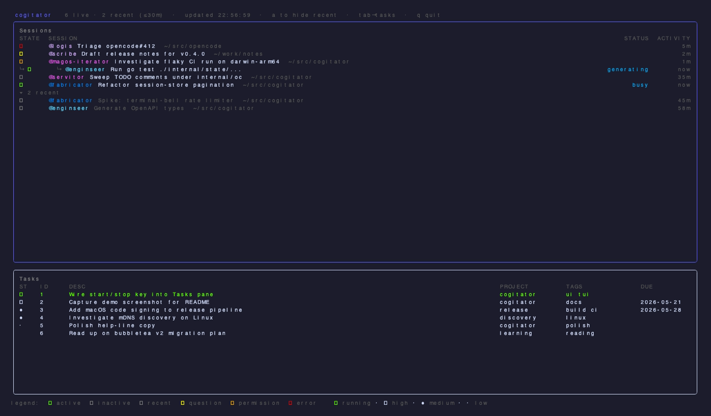

<div align="center">

# cogitator

[Docs](https://guilhermehto.github.io/cogitator/) · [Install](#1-install)

</div>

<p align="center">
  <em>Monitor coding agents, spin up git worktrees, jump between them, all from one place.</em>
</p>

<p align="center">
  
</p>

<p align="center">
  <a href="https://guilhermehto.github.io/cogitator/">▶&#xFE0E; Watch the demo</a>
</p>

cogitator is a TUI dashboard for your harnesses. It gives you a live view of sessions and allows you to manage your worktrees:

- **See status at a glance**: discovers running instances, flagging which sessions need you (permission requests, pending questions, errors).
- **Create git worktrees**: spin up a new worktree for a branch, or fetch, pull, and delete existing ones, straight from the roster.
- **Bundle multi-repo workspaces**: group several repos into a workspace and create a session that checks out one new branch across every member repo at once; `Tab` swaps between the Sessions and Workspaces panes.
- **Navigate into them**: jump to a running agent or resume a stopped one in a tmux session (or window) with a single keystroke.
- **Works across harnesses**: opencode, Claude Code, Codex, and omp.

## Table of contents

- [Getting started](#getting-started)
  - [1. Install](#1-install)
  - [2. Run cogitator](#2-run-cogitator)
  - [3. Connect your coding agent](#3-connect-your-coding-agent)
    - [opencode](#opencode)
    - [Claude Code](#claude-code)
    - [Codex](#codex)
    - [omp](#omp)
- [Key bindings](#key-bindings)
- [Configuration](#configuration)
- [Workspaces](#workspaces)
- [Live attention reference](#live-attention-reference)
  - [Claude Code](#claude-code-reference)
  - [Codex](#codex-reference)
  - [omp](#omp-reference)
- [CLI reference](#cli-reference)
- [Logging](#logging)
- [Architecture overview](#architecture-overview)
- [Status mode](#status-mode)
- [Notes for macOS unsigned binaries](#notes-for-macos-unsigned-binaries)
- [Development](#development)
- [Roadmap](#roadmap)

## Getting started

- **Automated** — paste a prompt into the agent itself and let it do the setup.
- **Manual** — do the setup yourself, step by step.

### 1. Install

| OS | Support |
| --- | --- |
| macOS | Supported |
| Linux | Supported |
| Windows | Not supported |

**Go install:**

```sh
go install github.com/guilhermehto/cogitator/cmd/cogitator@latest
```

**Homebrew:**

```sh
brew install guilhermehto/tap/cogitator
```

### 2. Run cogitator

```sh
cogitator
```

or from source:

```sh
go run ./cmd/cogitator
```

### 3. Connect your coding agent

Pick the harness you use below. You only need to do this once.

#### opencode

opencode advertises itself over mDNS and cogitator discovers it automatically. The only
setup is launching opencode with the `--mdns` flag, which could be added to your `opencode` alias.

**Automated** — paste this to your agent:

```text
Add a shell alias named `ocm` to my shell startup file (~/.zshrc, ~/.bashrc, or whichever
my shell actually uses), defined as:

    alias ocm='opencode --mdns'

Preserve the rest of the file. Then tell me to reload my shell (or open a new terminal)
and start opencode with `ocm` from now on so cogitator can see it.
```

**Manual:**

Launch opencode with `--mdns` so it advertises on `_http._tcp.local.`:

```sh
opencode --mdns                       # default port (random)
opencode serve --mdns --port 7777     # headless, fixed port
```

You can launch as many as you like; cogitator discovers them automatically.

#### Claude Code

cogitator displays live attention signals for [Claude Code](https://docs.anthropic.com/en/docs/claude-code)
sessions using Claude Code's lifecycle hooks. Monitoring **auto-enables** when
`~/.claude/projects` exists — no environment variable needed.

**Automated** — paste this to Claude Code:

```text
Set up cogitator live-attention monitoring for Claude Code on this machine.

1. Run `which cogitator` to find the absolute path to the cogitator binary. If it is not
   found, stop and tell me to install cogitator first.
2. Open ~/.claude/settings.json, creating it if it does not exist. Preserve every existing
   top-level key.
3. Merge the hooks below into the `hooks` object. Replace the bare command `cogitator`
   with the absolute path you found in step 1 (the hook runner may not inherit my
   interactive PATH):

   {
     "hooks": {
       "SessionStart":     [ { "hooks": [ { "type": "command", "command": "cogitator claude-hook" } ] } ],
       "UserPromptSubmit": [ { "hooks": [ { "type": "command", "command": "cogitator claude-hook" } ] } ],
       "PreToolUse":       [ { "matcher": "*", "hooks": [ { "type": "command", "command": "cogitator claude-hook" } ] } ],
       "PostToolUse":      [ { "matcher": "*", "hooks": [ { "type": "command", "command": "cogitator claude-hook" } ] } ],
       "Stop":             [ { "hooks": [ { "type": "command", "command": "cogitator claude-hook" } ] } ],
       "Notification":     [ { "hooks": [ { "type": "command", "command": "cogitator claude-hook" } ] } ],
       "SessionEnd":       [ { "hooks": [ { "type": "command", "command": "cogitator claude-hook" } ] } ]
     }
   }

4. Save the file and tell me to restart Claude Code so the hooks take effect.
```

**Manual:**

1. Confirm `~/.claude/projects` exists (it does once you've run Claude Code at least once).
2. Wire the hooks in `~/.claude/settings.json` — cogitator does **not** write this file, so
   paste the block yourself:

   ```json
   {
     "hooks": {
       "SessionStart":     [ { "hooks": [ { "type": "command", "command": "cogitator claude-hook" } ] } ],
       "UserPromptSubmit": [ { "hooks": [ { "type": "command", "command": "cogitator claude-hook" } ] } ],
       "PreToolUse":       [ { "matcher": "*", "hooks": [ { "type": "command", "command": "cogitator claude-hook" } ] } ],
       "PostToolUse":      [ { "matcher": "*", "hooks": [ { "type": "command", "command": "cogitator claude-hook" } ] } ],
       "Stop":             [ { "hooks": [ { "type": "command", "command": "cogitator claude-hook" } ] } ],
       "Notification":     [ { "hooks": [ { "type": "command", "command": "cogitator claude-hook" } ] } ],
       "SessionEnd":       [ { "hooks": [ { "type": "command", "command": "cogitator claude-hook" } ] } ]
     }
   }
   ```

3. Restart Claude Code. Hooks take effect on the next session.

> **PATH note:** the hook runner may not inherit your interactive shell PATH. If
> `cogitator` is not found, replace `"cogitator claude-hook"` with its absolute path —
> e.g. `"/Users/you/go/bin/cogitator claude-hook"` (use `which cogitator` to find it).

See [Live attention reference → Claude Code](#claude-code-reference) for how it behaves.

#### Codex

cogitator displays live attention signals for [Codex](https://openai.com/codex) sessions
using Codex's lifecycle hooks. Monitoring **auto-enables** when `~/.codex` exists — no
environment variable needed.

**Automated** — paste this to Codex:

```text
Set up cogitator live-attention monitoring for Codex on this machine.

1. Run `which cogitator` to find the absolute path to the cogitator binary. If it is not
   found, stop and tell me to install cogitator first.
2. Open ~/.codex/hooks.json, creating it if it does not exist. Preserve any existing keys.
3. Merge the hooks below into the `hooks` object. Replace the bare command `cogitator`
   with the absolute path you found in step 1:

   {
     "hooks": {
       "SessionStart":      [ { "hooks": [ { "type": "command", "command": "cogitator codex-hook" } ] } ],
       "UserPromptSubmit":  [ { "hooks": [ { "type": "command", "command": "cogitator codex-hook" } ] } ],
       "PreToolUse":        [ { "matcher": "*", "hooks": [ { "type": "command", "command": "cogitator codex-hook" } ] } ],
       "PostToolUse":       [ { "matcher": "*", "hooks": [ { "type": "command", "command": "cogitator codex-hook" } ] } ],
       "PermissionRequest": [ { "matcher": "*", "hooks": [ { "type": "command", "command": "cogitator codex-hook" } ] } ],
       "Stop":              [ { "hooks": [ { "type": "command", "command": "cogitator codex-hook" } ] } ]
     }
   }

4. Save the file, then remind me to start `codex`, run `/hooks`, and confirm trust for
   `cogitator codex-hook` — Codex skips untrusted hooks silently.
```

**Manual:**

1. Confirm `~/.codex` exists (it does once Codex is installed).
2. Wire the hooks in `~/.codex/hooks.json`:

   ```json
   {
     "hooks": {
       "SessionStart":      [ { "hooks": [ { "type": "command", "command": "cogitator codex-hook" } ] } ],
       "UserPromptSubmit":  [ { "hooks": [ { "type": "command", "command": "cogitator codex-hook" } ] } ],
       "PreToolUse":        [ { "matcher": "*", "hooks": [ { "type": "command", "command": "cogitator codex-hook" } ] } ],
       "PostToolUse":       [ { "matcher": "*", "hooks": [ { "type": "command", "command": "cogitator codex-hook" } ] } ],
       "PermissionRequest": [ { "matcher": "*", "hooks": [ { "type": "command", "command": "cogitator codex-hook" } ] } ],
       "Stop":              [ { "hooks": [ { "type": "command", "command": "cogitator codex-hook" } ] } ]
     }
   }
   ```

3. Trust the hook: start `codex`, run `/hooks`, and confirm trust for
   `cogitator codex-hook`. Until trusted, Codex skips the hook silently.

See [docs/codex.md](docs/codex.md) for the full setup guide (inline TOML alternative,
minimal hook variant, and `CODEX_HOME` override), and
[Live attention reference → Codex](#codex-reference) for how it behaves.

#### omp

cogitator displays live attention signals for [Oh My Pi (omp)](https://oh-my-pi.dev)
sessions. Monitoring **auto-enables** when the omp agent directory (`~/.omp/agent`,
or `$PI_CODING_AGENT_DIR` / `$PI_CONFIG_DIR/agent`) exists — no environment variable
needed. omp sessions then appear in the Sessions pane from a filesystem poll alone.

omp has **no external command-hook** like Codex/Claude (its hooks are in-process
TypeScript modules), so live attention is wired through a small extension cogitator
ships (embedded in the binary). Install it with one command:

```sh
cogitator omp-hook install
```

This writes `~/.omp/agent/extensions/cogitator.ts` with the absolute cogitator
binary path baked in, so it works even when `cogitator` is not on the omp process
PATH. Restart omp afterward.

**Automated** — paste this to omp:

```text
Set up cogitator live-attention monitoring for omp on this machine.

1. Run `which cogitator` to confirm cogitator is installed. If it is not found, stop
   and tell me to install cogitator first.
2. Run `cogitator omp-hook install` — it writes the live-attention extension into
   ~/.omp/agent/extensions/ with the cogitator binary path baked in.
3. Tell me to restart omp so the extension loads.
```

**Manual (repo checkout):** copy `internal/omp/cogitator.ts` to
`~/.omp/agent/extensions/cogitator.ts` (user-level) or `<repo>/.omp/extensions/cogitator.ts`
(project-level). With a manual copy the extension spawns `cogitator` by name, so ensure
`which cogitator` resolves in the shell that launches omp; the installer avoids this by
baking in the absolute path.

See [docs/omp.md](docs/omp.md) for the full setup guide and the event→attention mapping,
and [Live attention reference → omp](#omp-reference) for how it behaves.

## Key bindings

| Key | Context | Action |
| --- | --- | --- |
| `ctrl+P` | anywhere (outside a prompt) | open the session switcher: fuzzy-find a repo/branch or workspace session (listed as `<workspace>/<session>`) and jump to it (`cmd+P` is not supported — terminals don't forward it to TUI apps) |
| `Tab` | anywhere (outside a prompt) | swap focus between the Sessions and Workspaces panes |
| `a` | Sessions pane focused | toggle collapsed/expanded recent sessions |
| `P` | Sessions pane focused | pull latest into the highlighted worktree's branch (`git pull --ff-only --no-tags origin <branch>`); handy for refreshing a base branch before branching off it |
| `N` | Workspaces pane focused | create a new, empty workspace |
| `n` | Workspaces pane focused | create a session in the workspace under the cursor: prompts for a session name, then a harness, then checks out one new branch across every member repo |
| `e` | Workspaces pane focused | open the repo-membership modal for the workspace under the cursor: attach a repo found under `$HOME`, or detach a current member |
| `D` | Workspaces pane focused | delete the session or workspace under the cursor, behind a two-step `y`/`y` confirm that shows each member repo's branch merge status |
| `Enter` | Workspaces pane focused, on a session row | launch the session in tmux |
| `Esc` | inside add/edit prompt | cancel the prompt without quitting |
| `Enter` | inside add/edit prompt | submit the prompt |

> **Note:** `Tab` inside the inline add/edit prompt is consumed by the text
> input widget (cursor movement / suggestion acceptance is disabled, so Tab
> does nothing there). Use `Esc` to cancel the prompt without quitting.

## Configuration

cogitator persists durable settings as JSON at `$XDG_CONFIG_HOME/cogitator/config.json`
(or `~/.config/cogitator/config.json` when `$XDG_CONFIG_HOME` is unset). The file is
created on first use and is safe to edit by hand. `launchMode` and `defaultHarness` have
no in-app setter, so editing this file is the only way to change them.

```json
{
  "repos": [
    "/Users/you/src/cogitator",
    "/Users/you/src/another-project"
  ],
  "defaultHarness": "opencode",
  "launchMode": "session"
}
```

| Field | Type | Default | Description |
| --- | --- | --- | --- |
| `repos` | string array | `[]` | Absolute paths to the git repositories cogitator tracks for worktree launching. Normally managed from the UI — press `A` in the Sessions pane to fuzzy-find and add a repo — so entries usually appear here without hand-editing. Paths are canonicalized; a configured repo missing from disk is still listed but its worktree actions are disabled. |
| `defaultHarness` | string | `opencode` | Harness pre-selected when you create a new worktree (`n`). One of `opencode`, `claude-code`, `codex`, `omp`. Empty falls back to `opencode`. |
| `launchMode` | string | `session` | How a worktree opens in tmux: `window` or `session`. Empty or any unrecognized value falls back to `session`. |
| `workspaceRoot` | string | `` (empty) | Directory under which workspace session bundles are created (one git worktree per member repo, per session). Empty uses `$XDG_DATA_HOME/cogitator/workspaces`, falling back to `~/.local/share/cogitator/workspaces` when `$XDG_DATA_HOME` is unset. A leading `~` is expanded. Rejected if it resolves inside an existing git working tree. |

### tmux window vs session

`launchMode` controls how launching or jumping to a worktree places it in tmux:

- **`session`** (default) — opens each worktree as its own **new tmux session**. Each
  worktree is isolated with its own window list; switch with tmux's session switcher
  (`prefix` + `s`) or cogitator's own switcher (`ctrl+P`). Best when you prefer one session
  per task or branch.
- **`window`** — opens each worktree as a new **window in your current tmux session**.
  Worktrees stay grouped under one session; move between them with your usual tmux window
  keys (`prefix` + number / `n` / `p`). Best when you run cogitator inside an existing tmux
  session and want everything in one place.

Either way, cogitator reuses an existing window/session for a worktree when one is already
open instead of creating a duplicate. Edits to `launchMode` take effect on the next launch —
no restart needed.

## Workspaces

A **workspace** bundles several repos so you can work across all of them on one
branch. Creating a session inside a workspace checks out that branch as a real
git worktree in *every* member repo, laid out side by side under one session
directory. Press `Tab` to swap between the Sessions pane (single-repo
worktrees) and the Workspaces pane.

- **Real directories, not symlinks**: every supported harness (opencode, Claude
  Code, Codex, omp) searches with ripgrep, which skips symlinked directories
  unless you pass `-L`. Member worktrees are real checkouts, so ripgrep sees
  every file in them.
- **Disk cost**: one working-tree checkout per member repo, per session — git
  history itself is shared with the repo's other worktrees, not duplicated,
  but each session materializes its own copy of the checked-out files.
- **Divergent bases**: each member's branch is created from that repo's own
  current `HEAD`, so if repo A is on `main` and repo B is on a feature branch,
  their new worktrees start from different points.
- **Membership is independent of `repos`**: the flat `repos` list (Sessions
  pane) and a workspace's member repos are tracked separately — adding a repo
  to a workspace does not add it to `repos`, and vice versa.
- **Hidden repo basenames are rejected**: a member whose directory basename
  starts with `.` (e.g. `~/.dotfiles`) is refused, for the same reason ripgrep
  skips it — the worktree would be invisible to search.
- **Adding a member later**: attaching a repo to a workspace that already has
  sessions prompts which of those sessions to backfill with a new worktree for
  it; sessions you skip keep their existing member list.

`ctrl+P` lists workspace sessions in the session switcher too, labelled
`<workspace>/<session>`. See [Key bindings](#key-bindings) for the full set of
Workspaces-pane keys (`N`, `n`, `e`, `D`).

## Live attention reference

Setup for each harness lives in [Getting started → Connect your coding agent](#3-connect-your-coding-agent).
This section explains how live attention behaves once it's wired up.

<a id="claude-code-reference"></a>

### Claude Code

cogitator subscribes to Claude Code's lifecycle hooks to track each session's attention
state. Monitoring is auto-enabled when `~/.claude/projects` exists.

If cogitator is not running when a hook fires, `cogitator claude-hook` exits 0 silently —
Claude Code shows no failure and never blocks your tool calls.

<a id="codex-reference"></a>

### Codex

cogitator subscribes to Codex's lifecycle hooks. Each event maps to an attention state:

| Event | Attention state |
| --- | --- |
| `SessionStart` | active |
| `UserPromptSubmit` | active |
| `PreToolUse` / `PostToolUse` | active |
| `PermissionRequest` | permission-pending |
| `Stop` | idle / awaiting |

Hooks are enabled by default in Codex (`codex features list | grep hooks`). `PreToolUse`
and `PostToolUse` fire on every tool call; for less process churn, wire only
`SessionStart`, `PermissionRequest`, and `Stop` (see the minimal variant in
[docs/codex.md](docs/codex.md)). If cogitator is not running when a hook fires,
`cogitator codex-hook` exits 0 silently — Codex shows no failure and never blocks your
tool calls.

<a id="omp-reference"></a>

### omp

cogitator polls `~/.omp/agent/sessions/**/*.jsonl` so omp sessions appear with a
recency-derived liveness label without any setup. The shipped extension
(`extensions/cogitator.ts`) adds real-time attention by forwarding lifecycle events
over `cogitator omp-hook`:

| omp event | Attention state |
| --- | --- |
| `session_start` / `turn_start` / `agent_start` | active |
| `tool_call` (tool `ask`) | question-pending |
| `tool_result` (error) | errored |
| `turn_end` / `agent_end` / `session_shutdown` | idle / awaiting |

omp does not expose a permission-request hook event, so there is no distinct
permission-pending state for omp — the `ask` tool surfaces as question-pending. If
cogitator is not running, the extension's spawn fails silently and `cogitator omp-hook`
exits 0 — omp shows no failure and never blocks your turns.

## CLI reference

- `--bell`: ring the terminal bell when a session transitions into an attention state.
- `--status`: print a one-shot icons-only status line and exit.
- `--demo`: launch the TUI with a curated synthetic snapshot (mixed session states, tasks, a running task). No mDNS, no `task` shell-outs; intended for screenshots and walkthroughs.
- `--debug`: show diagnostic UI elements that are noisy during normal use (e.g. the unreachable-instance footer).
- `--log-level`: set log verbosity (`debug|info|warn|error`). Default is `info`.
- `--version`: print module version, commit, and build date.

## Logging

Logs are written with `log/slog` text formatting.

- If `$XDG_STATE_HOME` is set: `$XDG_STATE_HOME/cogitator/cogitator.log`
- Otherwise: `/tmp/cogitator.log`

## Architecture overview

- `internal/discovery`: mDNS browsing and add/remove events for opencode instances.
- `internal/supervisor`: per-instance lifecycle (permissions poll, recency poll, SSE loop, reconnect backoff).
- `internal/oc`: HTTP + SSE API access and generated OpenAPI-derived core types.
- `internal/state`: in-memory aggregation and dedupe across instances, attention classification, unreachable-instance tracking.
- `internal/ui`: Bubble Tea model, rendering, status mode, and footer warnings.
- `internal/config`: single source of timing/threshold defaults.

## Status mode

`--status` runs discovery/supervision without opening the TUI and prints a compact status line.
It exits when either:

- a non-empty snapshot arrives, or
- the status deadline is reached (default: 3s).

## Notes for macOS unsigned binaries

Current releases are unsigned. If Gatekeeper blocks first launch, either use Finder "Open" once, or clear quarantine:

```sh
xattr -d com.apple.quarantine cogitator
```

## Development

Common local targets:

```sh
make vet
make lint
make test
make ci
```

OpenAPI workflow:

```sh
make capture-schema
make generate
```

## Roadmap

- macOS code signing + notarization (blocked on Apple Developer Program enrolment).
- OpenAPI-derived SSE event payload types (blocked on opencode publishing the event-stream schema).
